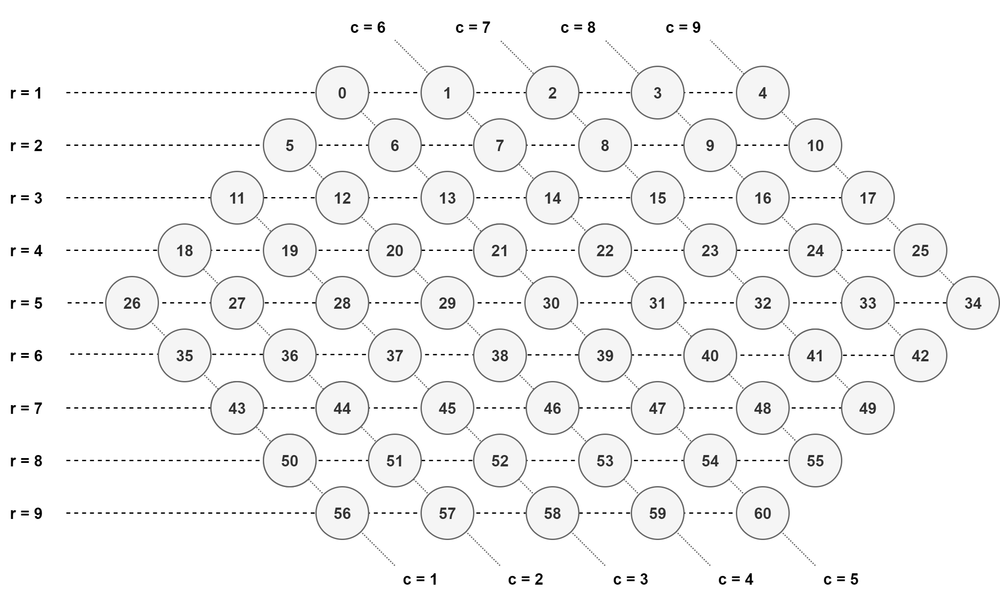

# gym-abalone

<p align="center">
    </br>
</p>

***Abalone is a registered trademark of Abalone S.A. - France***

## Table of Contents

1. [Game-presentation](#Game-presentation)
   1. [Introduction](#Introduction)
   2. [Object of the game](#Object-of-the-game)
   3. [Gameplay](#Gameplay)
2. [Rules](#Rules)
   1. [Starting-positions ](#Starting-positions)
   2. [Permitted-moves](#Permitted-moves)
   3. [Pushing-the-opponent](#Pushing-the-opponent)
      1. [Sumito](#Sumito)
      2. [Pac](#Pac)
   4. [Forbidden-moves](#Forbidden-moves)
3. [Environments](#Environments)
   1. [Features of Environment](#Features-of-Environment)
   2. [Episode termination](#Episode-termination)
   2. [Observations](#Observations)
   3. [Actions](#Actions)
   4. [Reward Function](#Reward-Function)
4. [Installation](#Installation)
5. [Usage](#Usage)
6. [Misc](#Misc)
   1. [Abalone variations](#Abalone-variations)
      1. [Game start variant](#Game-start-variant)
      2. [More player](#More-player)
      3. [Limited Time](#Limited-Time)
      4. [Blitz Competition](#Blitz-Competition)
   2. [Citation](#Citation)
   3. [Contribute](#Contribute)
   
# Game-presentation

https://en.wikipedia.org/wiki/Abalone_%28board_game%29

## Introduction

Abalone is an two-player abstract strategy board game.
It was designed by Michel Lalet and Laurent Lévi in 1987.
Players each starts with 14 marbles placed on a hexagonal board.

## Object of the game

By pushing a marble from the opponent over the edge, it is placed outside the board and the marble no longer participates. The winner is the first player to push six of the opponent's marbles out of the board.

## Gameplay

On their turn, each player may move either a single marble or *column* of marbles of their own color one space.
A *column* consists of two or three marbles of the same color directly adjacent to one another in a straight line.
A marble or a column can move in any direction as long as the move is permitted by the rules.

# Rules

## Starting-positions 

At the begining of the game, marbles are placed following one of the predefined starting lineup / variant. A variant is said to be balanced if black and white marbels' positions are symmetric. Dozens of alternative variant can be used. 
The most popular one's are :
-   « Classical setup » proposed by the game's creators.
-   « Belgian daisy » used in tournaments.

**gym-abalone** currently implement 60 variants. Adding new variant is simple as adding an item to the json configuration file.

<table>
<tr>
<th>
json item
</th>
<th>
Result
</th>
</tr>
<tr>
<td>

```json
"classical": {
"id": 11,
"board_nb": 61,
"players": 2,
"players_sets": [
[45,46,47,50,51,52,53,54,55,56,57,58,59,60],
[0,  1, 2, 3, 4, 5, 6, 7, 8, 9,10,13,14,15]]
}
```
</td>
<td>
<pre>
</br>
</pre>
</td>
</tr>
</table>

See all the supported [variations](https://github.com/towzeur/gym-abalone/tree/master/script/80)


## Permitted-moves

Each player can only do one action on his turn. 
There are two types of moves that don't involve the opponent :

| Moves               | Diagram                                           |
| :---:               | :---:                                             |
| An "In-line" move: Marbles are moved as a column into a free space      |    |
| A "Side step" move: Marbles are moved sideways into adjacent freespaces |  |


## Pushing-the-opponent

### Sumito 

There are only 3 possibilities for pushing the opponent's marbles. Theses situations are called "sumito". 

| Sumito                          | Diagram                                           |
| :---:                           | :---:                                             |
| A "3-push-2 Sumito" ⚫️⚫️⚫️⚪️⚪️ |  |
| A "3-push-1 Sumito" ⚫️⚫️⚫️⚪️   |  |
| A "2-push-1 Sumito" ⚫️⚫️⚪️     |  |

### PAC

Another important rule in Abalone concerns "Pac" situations. In these situations, players can't perform Sumito moves because none of them have the numerical lead.

-	1 vs 1  ⚫️ ⚪️
-	2 vs 2  ⚫️⚫️ ⚪️⚪️
-	3 vs 3  ⚫️⚫️⚫️ ⚪️⚪️⚪️


## Forbidden-moves

- A single marble can never pushan opposing marble.
- A side stepping column cannot push any marble.
- All marbles in a column must move in the same direction.
- Enemy marbles sandwiched between friendly marbles may not be pushed
- At any turn, no more than 3 friendly marbles can be moved, thus an opponent’s Column of three can never be pushed. A position of 4-on-3 or greater is not considered a Sumito

# Environments

<table>
    <tbody>
        <tr>
            <td> </br> </td>
            <td> </br> </td>
        </tr>
    </tbody>
</table>
<em> Two games played by random agent </em>


## Features of Environment

From the point of view of an agent, Abalone have the following
features :

| Features          |       |    Features          |       |        
| :---              | :---: |         ---:         | :---: |
| Fully observable  |  YES  | Partially observable |    NO |
| Static            |  YES  | Dynamic              |    NO |
| Discrete          |  YES  | Continuous           |    NO |
| Deterministic     |  YES  | Stochastic           |    NO |
| Single agent      |   NO  | Multi-agent          |   YES |
| Competitive       |  YES  | Collaborative        |    NO |
| Episodic          |  YES  | Sequential           |    NO |

## Observations

Each cell can be placed into an orthogonal 2-dimension basis. Each of the 61 cells thus have a unique pair of coordinates (r, c) which respectively corresponds to its row and its column.

```
  0 1 2 3 4 5 6 7 8 9 10
 0            
 1          ● ● ● ● ● 
 2        ● ● ● ● ● ● 
 3      · · · ● ● ● ·  
 4    · · · · · · · · 
 5  · · · · · · · · · 
 6  · · · · · · · · 
 7  · · o o o · ·   
 8  o o o o o o    
 9  o o o o o     
10         
```

</br>
<em>orthogonal basis</em>

The observations is an encoded numpy arrays of size (11, 11). These arrays contain signed 8-bit integer values in the [-128, 127] range. 
The choice of 8-bit integer values was made because we only need a couple of integer to represents the different value of the cells. 

```
>>> env = gym.make('abalone-v0', variant_name='classical')
>>> env.observation

[[-2 -2 -2 -2 -2 -2 -2 -2 -2 -2 -2]
 [-2 -2 -2 -2 -2  1  1  1  1  1 -2]
 [-2 -2 -2 -2  1  1  1  1  1  1 -2]
 [-2 -2 -2 -1 -1  1  1  1 -1 -1 -2]
 [-2 -2 -1 -1 -1 -1 -1 -1 -1 -1 -2]
 [-2 -1 -1 -1 -1 -1 -1 -1 -1 -1 -2]
 [-2 -1 -1 -1 -1 -1 -1 -1 -1 -2 -2]
 [-2 -1 -1  0  0  0 -1 -1 -2 -2 -2]
 [-2  0  0  0  0  0  0 -2 -2 -2 -2]
 [-2  0  0  0  0  0 -2 -2 -2 -2 -2]
 [-2 -2 -2 -2 -2 -2 -2 -2 -2 -2 -2]]

 >>> env.observation.shape
(11, 11)
 ```

|            |   EMPTY  |  VOID | PLAYERS               |
| :---:      |   :---:  | :---: | :---:                 |
| **Token**  |  -1      |  -2   | 0, 1, ... (up to 127) |


Thanks to this basis, we can access the 6 neighbours' of a cell by appyling the same constant row's and column's shifts :

|       | LEFT | RIGHT | UP_LEFT | UP_RIGHT | DOWN_LEFT | DOWN_RIGHT |
| :---: | :---:|  :---:|    :---:|     :---:|      :---:|       :---:|     
| Δ row | 0    |    0  |      -1 |        -1|         +1|          +1|     
| Δ col | -1   |   +1  |       0 |        +1|         -1|           0|


## Actions

A move in Abalone may be described in two parts: selecting the marble to move (pos0), and then selecting among the legal moves for that marble (pos1). 
We represent the policy π(a|s) by a 61 × 61 = **3721** column vector encoding a probability distribution over all possible moves. 
However, only of fraction of this moves are legal moves.
The order of magnitude of the number of possible actions is 60 for the Abalone game. 
In order to help agents to always select legal actions, the environment provides the function `env.get_action_mask()`. It return a numpy array of size 3721 that 'masks' illegal move by putting a 0 at the corresponding indexes and and 1 at the legal index.
The index of an action `(pos0, pos1)` is given by `idx = pos0 × 61 + pos1` and you can go back from the action index to the corresponding action by computing the quotient and remainder of the index with 61 :  `(pos0, pos1) = (idx // 61, idx % 61)`  


## Reward Function

The default reward function simply assigns a fixed reward according to the nature of the action taken by the agent. It tries to encourage the agent to push the oponent's marble. Winning the game give the agent a great rewards. To encourage fights, agents are punished for moves that don't involves the opponent.

|                |'winner'|'ejected'|'inline_push'|'sidestep_move'|'inline_move' |
| :---:          | :---:  | :---:   |      :---:  |        :---:  |       :---:  |
| **Reward**     |   12   |   2     |        0.5  |         -0.1  |         -0.1 |


See the `step` function in [abalone_env.py](https://github.com/towzeur/gym-abalone/blob/master/gym_abalone/envs/abalone_env.py) for more details.

You can also implement your own reward :

```python
class Reward:

    @staticmethod
    def method_1(observation, move_type):

        reward = # compute the reward here given the observation 
                 #  and the move type

        return reward
```

## Episode termination

The episode is terminated if one of the agent win, or if the `max_steps` (default to 200) parameter is exceeded. You can change this parameters when you call the constructor of `AbaloneEnv`.


# Installation

## Requirements:

- Python 3.6+
- OpenAI gym
- NumPy
- Pyglet
- 
- Keras or Tensorflow (to use the agents in `Agents/`)

Dependencies can be installed with `pip` or `conda`:

##  Using pip

```
$ git clone git@github.com:towzeur/gym-abalone.git
$ cd gym-abalone
$ pip install -e .
```

# Usage

```python
import gym
import abalone_env

env = gym.make("abalone-v0")

done = False
while not done:
    action = ... # Your agent code here
    obs, reward, done, _ = env.step(action)
    env.render()
```

# Misc

## Abalone variations

This rules variations are, for the moment, not implemented.

### Game start variant

At the beginning of the game, instead of placing the balls, each turn a
player places one of his 14 marble on the free space of his choice. 
During this phase, no movement is allowed. As soon as every marbles are placed the game begins.

### More player

Abalone can also be played as a three and four player game. To play these variations additional colored marbles are required.

### Limited Time

Each player can be given a limited amount of time, for example to 10 or 15 minutes each. Official competitions or tournaments are always played in limited time.

### Blitz-Competition

The number of balls to be ejected goes from 6 marbles to 4 marbles.

## Citation

Bibtex if you want to cite this repository in your publications:
```
@misc{gym_abalone,
  author = {towzeur},
  title = {Abalone Environments for OpenAI Gym},
  year = {2020},
  publisher = {GitHub},
  journal = {GitHub repository},
  howpublished = {\url{https://github.com/towzeur/gym-abalone}},
}
```

## Contribute

Feel free to contribute to this project. You can fork this repository and implement whatever you want. Alternatively, open a new issue in case you need help or want to have a feature added.


