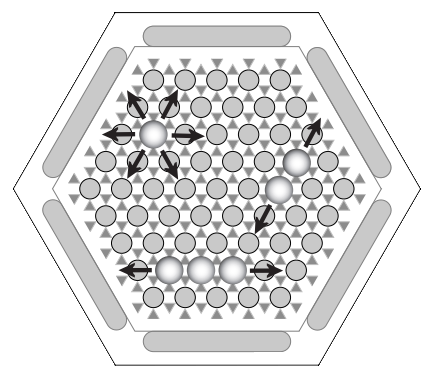
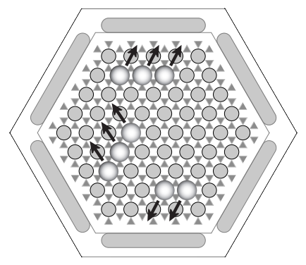
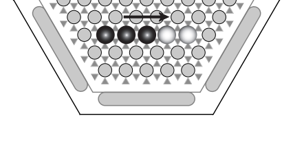
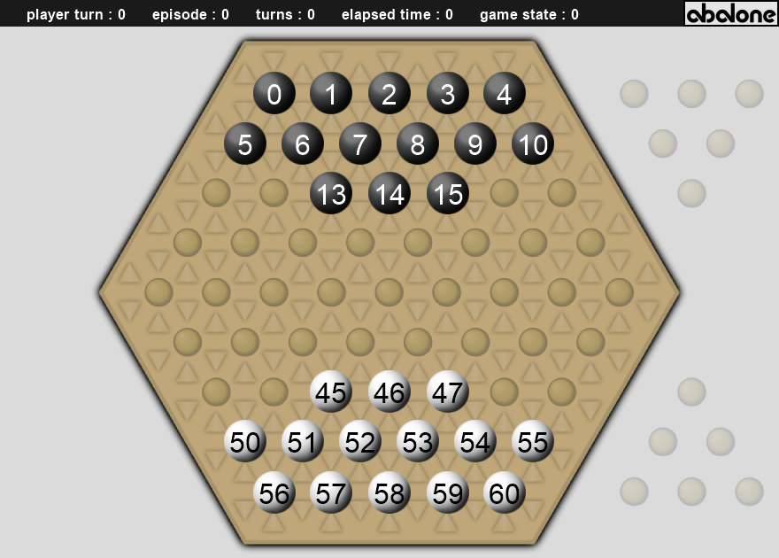

# Project-IA-gym-Abalone

<p align="center">
    </br>
    <em>Abalone + gym</em>
</p>


## Table of Contents

- [Presentation](#Game-presentation)
- [Environments](#Environments)
- [Installation](#installation)
- [Usage](#usage)
- [TODO](#TODO)

## Game-presentation

https://en.wikipedia.org/wiki/Abalone_%28board_game%29

### Overview

Abalone is an two-player abstract strategy board game.
The players have
It was designed by Michel Lalet and Laurent Lévi in 1987.
on a hexagonal board with the objective of pushing six of the opponent's marbles off the edge of the board

### Rules
w
The game starts with a starting lineup. Usually this is the standard setup,
but at tournaments and by advanced players one of the dozens of alternative starting setups is also used.
See #Starting-positions for more information 

#### Permitted-moves
Each turn, the current player can push up to 3 marble as long as the pushed marbles are aligned.
There is two possible directions :
-   Straight (the marbles move 'like a train with wagons')
-   Sideways (the marbles each move a square sideways, which counts as one movement).
-   Both straight and sideways


| Moves               | Diagram                                           |
| :---:               | :---:                                             |
| An "In-line" Move: Marbles are moved as a column into a free space      |    |
| A ‘Side step’ move: Marbles are moved sideways into adjacent freespaces |  |

#### Pushing-the-opponent

**Sumito**

In order to push opponent's marbles, one needs to be in one of the Sumito's situation.
i.e. the player must have the numerical superiority.


| Sumito              | Diagram                                           |
| :---:               | :---:                                             |
| A "3-push-2 Sumito" |  |
| A "3-push-1 Sumito" |  |
| A "2-push-1 Sumito" |  |

**PAC**

Another important rule in Abalone concerns "Pac" situations. In these situations, iT is impossible for 
Players can't perform Sumito moves in theses situations because none of them have the numerical lead.
-	1 vs 1
-	2 vs 2
-	3 vs 3
-	4 vs 3

One cannot push an enemy bullet if in the direction in which one wants to push it is a bullet of its own behind the enemy.
-	1 allied marble prevents the Sumito

By pushing a bullet from the opponent over the edge, it is placed outside the board and the bullet no longer participates. The player who pushed six bullets from the opponent off the board is the winner

#### Starting-positions 

See all the supported [variations](https://github.com/towzeur/script/80/)

There are several possible placements to start with, the most popular are :
-   « La formation Standard » proposée par les concepteurs du jeu.
-   é

In 1999, a number of top players from the Mind Sports Olympiad signed an agreement to use a different starting position (the Belgian daisy) to revitalize the game. This has been used for top tournaments since then, including the AbaCup.

## Environments

</br>

## Installation

`pip install --user git+https://github.com/towzeur/`

## Usage

```python
import gym
import abalone_env

env = gym.make("abalone-v0")

done = False
while not done:
    action = ... # Your agent code here
    obs, reward, done, _ = env.step(action)
    env.render()
```

## Milestone 

- [X] detect pos on click
- [X] detect pos on click
- [] add out_coordinates for removed marbles
- [] selected marble

